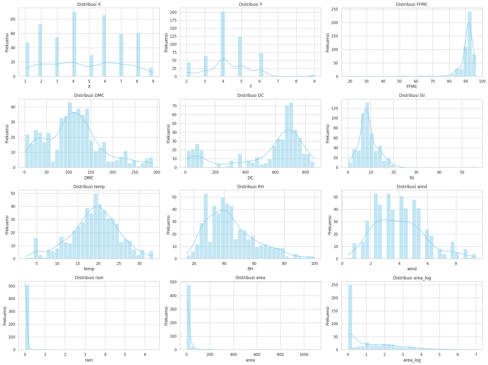
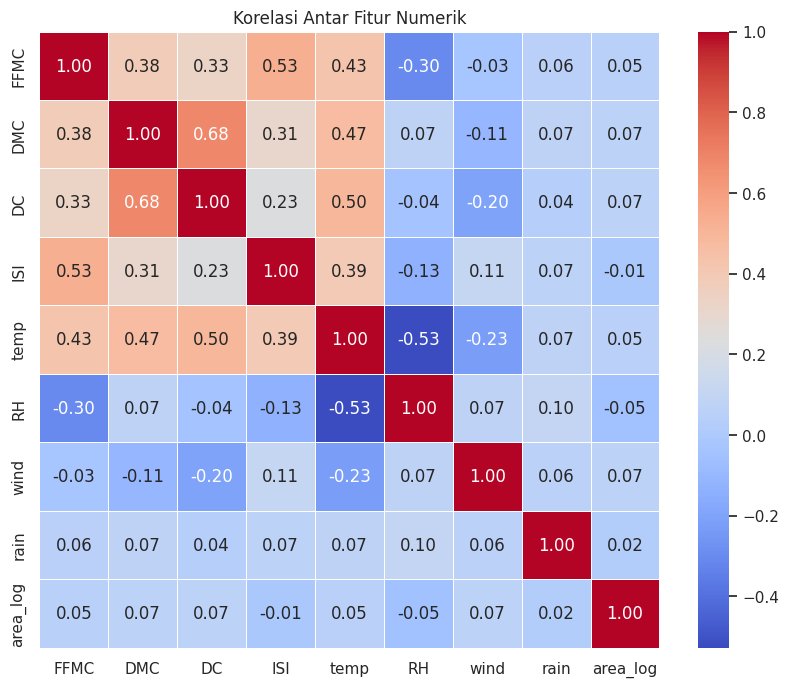
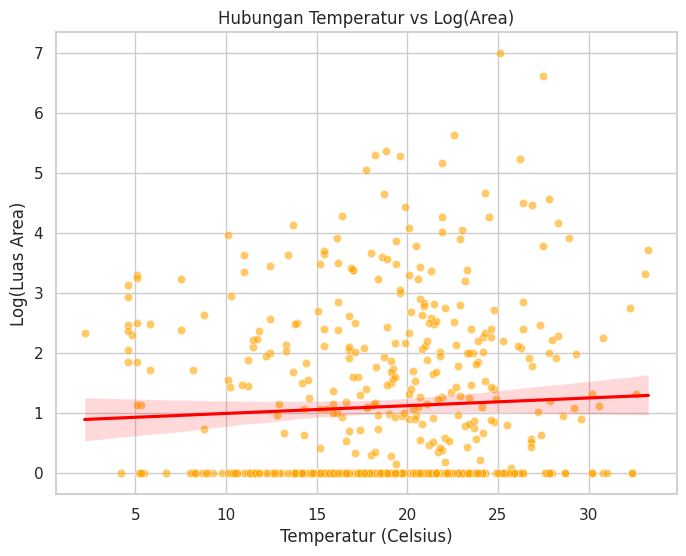
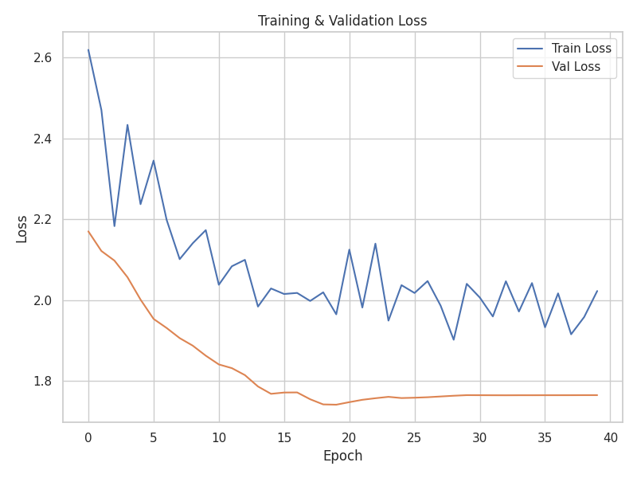
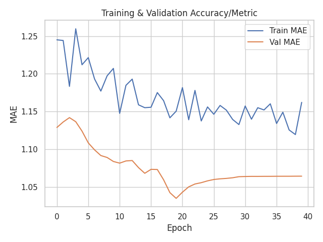

## INFORMASI PROYEK

**Judul Proyek:**  
Prediksi Luas Area Kebakaran Hutan Menggunakan Pendekatan Machine Learning dan Deep Learning

**Nama Mahasiswa:** Mohammad Fakhriza Maftukhin  
**NIM:** 234311018  
**Program Studi:** Teknologi Rekayasa Perangkat Lunak  
**Mata Kuliah:** Data Science  
**Dosen Pengampu:** Gus Nanang Syaifuddiin, S.Kom., M.Kom.  
**Tahun Akademik:** 2025/5
**Link GitHub Repository:** https://github.com/MohammadFakhrizaMaftukhin/ProyekDataScience.git
**Link Video Pembahasan:** [URL Repository]

---

## 1. LEARNING OUTCOMES
Pada proyek ini, mahasiswa diharapkan dapat:
1. Memahami konteks masalah dan merumuskan problem statement secara jelas
2. Melakukan analisis dan eksplorasi data (EDA) secara komprehensif (**OPSIONAL**)
3. Melakukan data preparation yang sesuai dengan karakteristik dataset
4. Mengembangkan tiga model machine learning yang terdiri dari (**WAJIB**):
   - Model baseline
   - Model machine learning / advanced
   - Model deep learning (**WAJIB**)
5. Menggunakan metrik evaluasi yang relevan dengan jenis tugas ML
6. Melaporkan hasil eksperimen secara ilmiah dan sistematis
7. Mengunggah seluruh kode proyek ke GitHub (**WAJIB**)
8. Menerapkan prinsip software engineering dalam pengembangan proyek

---

## 2. PROJECT OVERVIEW

### 2.1 Latar Belakang

Kebakaran hutan merupakan salah satu bencana lingkungan yang paling merugikan, baik dari segi ekologi maupun ekonomi. Di wilayah mediterania seperti Portugal, kejadian kebakaran hutan meningkat setiap tahunnya akibat perubahan iklim dan aktivitas manusia. Wilayah yang menjadi fokus penelitian ini adalah Taman Alam Montesinho di sektor timur laut Portugal, yang memiliki risiko kebakaran tinggi terutama pada musim panas.

Metode prediksi konvensional seringkali kesulitan mengestimasi keparahan kebakaran secara akurat karena kompleksitas interaksi variabel cuaca. Oleh karena itu, pendekatan berbasis data (Data Mining) menjadi solusi yang krusial. Berdasarkan penelitian yang dilakukan oleh Cortez dan Morais (2007), data meteorologi lokal—seperti suhu, kelembaban relatif, hujan, dan kecepatan angin—memiliki korelasi signifikan yang dapat dimanfaatkan untuk memprediksi luas area yang terbakar [Cortez & Morais (2007)].

Seiring perkembangan teknologi, metode Machine Learning telah terbukti efektif dalam manajemen risiko kebakaran hutan dengan memberikan prediksi yang lebih cepat dan data-driven dibandingkan metode manual [Jain et al. (2020)]. Selain itu, penerapan Deep Learning melalui arsitektur Multilayer Perceptron (MLP) menawarkan kemampuan untuk menangkap pola non-linear yang kompleks dalam data lingkungan, yang seringkali sulit dimodelkan oleh regresi statistik tradisional [Goodfellow et al. (2016)].

Dalam proyek ini, saya menggunakan dataset publik dari UCI Machine Learning Repository untuk mengimplementasikan dan membandingkan performa tiga pendekatan model: Linear Regression sebagai baseline, Random Forest sebagai representasi algoritma Machine Learning, dan Deep Learning untuk melihat potensi jaringan saraf tiruan dalam menangani data yang memiliki distribusi skewed.

**Referensi (berformat APA):**
> Cortez, P., & Morais, A. (2007). A data mining approach to predict forest fires using meteorological data. In Proceedings of the 13th EPIA 2007 - Portuguese Conference on Artificial Intelligence (pp. 512-523). Guimarães, Portugal.
> Jain, P., Coogan, S. C., Subramanian, S. G., Crowley, M., Taylor, S., & Flannigan, M. D. (2020). A review of machine learning applications in wildfire science and management. Environmental Reviews, 28(4), 478-505.
> Goodfellow, I., Bengio, Y., & Courville, A. (2016). Deep Learning. MIT Press.


## 3. BUSINESS UNDERSTANDING / PROBLEM UNDERSTANDING
### 3.1 Problem Statements

1. Model perlu mampu memprediksi estimasi luas area hutan yang terbakar (area) dengan tingkat error seminimal mungkin berdasarkan data meteorologi harian.
2. Dataset memiliki distribusi target yang sangat miring (highly skewed) ke arah nol, sehingga memerlukan strategi preprocessing khusus (seperti transformasi logaritma) agar model tidak bias.
3. Diperlukan evaluasi untuk menentukan apakah model kompleks seperti Deep Learning (MLP) mampu memberikan performa yang lebih baik dibandingkan metode Machine Learning konvensional (Random Forest) pada dataset dengan jumlah sampel terbatas.


### 3.2 Goals

1. Membangun model regresi yang mampu memprediksi estimasi luas area kebakaran hutan (area) dengan tingkat kesalahan (error) seminimal mungkin, diukur menggunakan metrik RMSE (Root Mean Squared Error) dan MAE (Mean Absolute Error).
2. Mengukur dan membandingkan performa dari tiga pendekatan algoritma yang berbeda, yaitu Linear Regression (Baseline), Random Forest (Advanced Machine Learning), dan Multilayer Perceptron (Deep Learning), khususnya pada data yang telah melalui transformasi logaritma.
3. Menentukan model terbaik yang paling efektif dan robust (kokoh) dalam menangani pola data cuaca yang kompleks dan distribusi target yang miring (skewed).
4. Menghasilkan kode eksperimen yang terstruktur dan dapat dijalankan ulang (reproducible) yang terdokumentasi dalam repositori GitHub.


### 3.3 Solution Approach

#### **Model 1 – Baseline Model**
Model sederhana sebagai pembanding dasar.

**Pilihan model:**
Linear Regression (untuk regresi)

**Penjelasan:**
Linear Regression adalah algoritma statistik dasar yang memodelkan hubungan antara variabel independen (fitur cuaca seperti suhu, angin, hujan) dan variabel dependen (target luas area) dengan mencocokkan persamaan linear ke data yang diamati. Model ini mencoba menemukan garis lurus terbaik yang meminimalkan selisih antara nilai prediksi dan nilai aktual.

**Alasan Pemilihan:**
1. Kesesuaian Tugas: Karena target prediksi (area) adalah nilai kontinu, Linear Regression adalah algoritma standar yang paling tepat untuk dijadikan titik awal (baseline) kasus regresi.
2. Benchmark: Model ini berfungsi sebagai tolak ukur performa. Jika model yang lebih kompleks (seperti Random Forest atau Deep Learning) tidak memberikan hasil yang jauh lebih baik daripada Linear Regression, maka kompleksitas tambahan tersebut mungkin tidak diperlukan.
3. Interpretabilitas: Model ini sangat mudah diinterpretasikan untuk melihat bagaimana setiap fitur cuaca berkontribusi secara langsung terhadap kenaikan atau penurunan prediksi luas area terbakar.


#### **Model 2 – Advanced / ML Model**
Model machine learning yang lebih kompleks.

**Pilihan model:**
Random Forest

**Penjelasan:**
Random Forest adalah algoritma ensemble learning yang bekerja dengan cara membangun banyak pohon keputusan (Decision Trees) selama pelatihan. Untuk tugas regresi, algoritma ini mengambil rata-rata prediksi dari setiap pohon individu untuk menghasilkan prediksi akhir. Pendekatan ini disebut Bagging karena membantu mengurangi varians dan risiko overfitting yang sering terjadi pada satu pohon keputusan tunggal.

**Alasan Pemilihan:**
1. Menangani Non-Linearitas: Hubungan antara variabel cuaca (seperti suhu dan kelembaban) dengan terjadinya kebakaran hutan seringkali kompleks dan tidak linear. Random Forest sangat efektif dalam menangkap pola non-linear ini melalui struktur pohon keputusannya.
2. Robust Terhadap Noise: Dataset Forest Fires diketahui memiliki banyak noise dan outlier (nilai kebakaran ekstrem). Random Forest lebih tangguh (robust) terhadap gangguan ini dibandingkan model regresi tunggal karena hasil prediksinya merupakan agregasi dari banyak model.
3. Stabilitas: Dibandingkan dengan Decision Tree tunggal yang cenderung tidak stabil (perubahan kecil pada data bisa mengubah struktur pohon secara drastis), Random Forest memberikan hasil yang lebih konsisten dan generalisasi yang lebih baik pada data pengujian.


#### **Model 3 – Deep Learning Model**
Model deep learning yang sesuai dengan jenis data.

**Pilihan Implementasi:**
Tabular Data

**Penjelasan Model:**
Multilayer Perceptron (MLP) adalah jenis jaringan saraf tiruan feedforward yang terdiri dari setidaknya tiga lapisan node: lapisan input, lapisan tersembunyi (hidden layer), dan lapisan output. Setiap node (kecuali node input) adalah neuron yang menggunakan fungsi aktivasi non-linear.
Untuk proyek ini, saya merancang arsitektur MLP sebagai berikut:
1. Input Layer: Menyesuaikan dengan jumlah fitur hasil preprocessing.
2. Hidden Layers: Menggunakan 2 hidden layers dengan fungsi aktivasi ReLU (Rectified Linear Unit) untuk menangkap pola non-linear.
3. Regularization: Menambahkan lapisan Dropout di antara hidden layer untuk mencegah overfitting.
4. Output Layer: Menggunakan 1 neuron dengan fungsi aktivasi Linear karena kasus ini adalah regresi (prediksi nilai kontinu).

**Alasan Pemilihan:**
1. Kompleksitas Data: Interaksi antara variabel meteorologi (suhu, angin, kelembaban) terhadap luas area kebakaran seringkali sangat kompleks dan tidak dapat dipisahkan secara linear. MLP memiliki kemampuan universal approximation yang memungkinkannya mempelajari fungsi pemetaan yang rumit tersebut.
2. Fleksibilitas Arsitektur: MLP memungkinkan kita untuk menyesuaikan jumlah neuron dan layer serta menambahkan teknik regularisasi seperti Dropout untuk menangani isu overfitting yang menjadi tantangan utama pada dataset berukuran kecil.

---

## 4. DATA UNDERSTANDING
### 4.1 Informasi Dataset
**Sumber Dataset:**  
UCI ML Repository

**Deskripsi Dataset:**
- Jumlah baris (rows): 517
- Jumlah kolom (columns/features): 13 (12 features + 1 target)
- Tipe data: Tabular
- Ukuran dataset: 0,0249 MB
- Format file: CSV

### 4.2 Deskripsi Fitur

| Nama Fitur | Tipe Data | Deskripsi | Contoh Nilai |
|------------|-----------|-----------|--------------|
| X | Integer | koordinat spasial sumbu X dalam peta taman Montesinho | 1 - 9 |
| Y | Integer | koordinat spasial sumbu Y dalam peta taman Montesinho | 2 - 9 |
| month | Categorical | bulan dalam setahun | januari - desember |
| day | Categorical | hari dalam seminggu | senin - minggu |
| FFMC | Continuous | Indeks FFMC dari sistem FWI | 18,7 - 96,20 |
| DMC | Integer | Indeks DMC dari sistem FWI | 1,1 - 291,3 |
| DC | Continuous | Indeks DC dari sistem FWI | 7,9 - 860,6 |
| ISI | Continuous | Indeks ISI dari sistem FWI | 0,0 - 56,10 |
| temp | Continuous | suhu (celcius) | 2,2 - 33,30 |
| RH | Integer | kelembaban relatif | 15,0 - 100 |
| wind | Continuous | kecepatan angin | 0,40 - 9,40 |
| rain | Integer | hujan | 0,0 - 6,4 |


### 4.3 Kondisi Data

Berdasarkan analisis eksplorasi data, berikut kondisi dan permasalahan yang ditemukan pada dataset:

- **Missing Values:** Tidak ada, 0 persen
- **Duplicate Data:** Ada, Terdapat 4 baris data duplikat
- **Outliers:** Ada, sangat signifikan pada variabel target area dan beberapa indeks FWI seperti `FFMC` dan `ISI`
- **Imbalanced Data:** Ada, bersifat Zero-Inflated (terlalu banyak nilai nol) dengan proporsi 48% data bernilai 0
- **Noise:** Fitur meteorologi seperti `rain` memiliki variansi yang sangat rendah (mayoritas 0) sehingga dapat dianggap sebagai noise atau fitur dengan informasi prediktif yang lemah.
- **Data Quality Issues: Tidak ada

### 4.4 Exploratory Data Analysis (EDA) - (**OPSIONAL**)

#### Visualisasi 1: Distribusi Seluruh Fitur Numerik



**Insight:**  
- **Target (`area`):** Sangat miring ke kanan (*right-skewed*). Mayoritas data bernilai 0, namun transformasi log (`area_log`) berhasil menormalkan distribusinya secara signifikan.
- **Fitur FWI (`FFMC`, `DMC`, `DC`, `ISI`):**
    - `FFMC` sangat miring ke kiri (*negative skew*), menunjukkan bahwa mayoritas data diambil saat kondisi hutan sangat mudah terbakar (FFMC tinggi).
    - `ISI` dan `rain` juga memiliki distribusi *skewed* dengan banyak nilai rendah/nol.
- **Fitur Cuaca (`temp`, `RH`, `wind`):**
    - `temp` (suhu) dan `wind` (angin) memiliki distribusi yang cukup normal (berbentuk lonceng), yang bagus untuk pemodelan statistik.
    - `RH` (kelembaban) sedikit miring ke kanan, namun masih tersebar cukup merata.

#### Visualisasi 2: Heatmap Korelasi Fitur



**Insight:**  
- Terdapat korelasi positif yang kuat antara fitur-fitur indeks FWI (Fire Weather Index), misalnya `DC` dan `DMC` memiliki korelasi tinggi (0.68), yang wajar karena keduanya mengukur kekeringan.
- Korelasi antara fitur cuaca (`temp`, `wind`, `rain`) dengan target `area_log` cenderung lemah (mendekati 0). Ini mengindikasikan bahwa prediksi kebakaran sangat menantang (stochastic) dan hubungan antar variabel tidak bersifat linear sederhana, sehingga memperkuat alasan penggunaan model non-linear seperti Random Forest dan Deep Learning.
- `temp` (suhu) memiliki korelasi positif terbesar terhadap indeks kebakaran (`FFMC`, `ISI`), menunjukkan suhu adalah faktor pendorong risiko kebakaran utama.

#### Visualisasi 3: Scatter Plot Temperatur vs Log(Area)



**Insight:**  
- Grafik menunjukkan bahwa kebakaran dengan area luas (sumbu Y tinggi) cenderung terjadi pada temperatur tinggi (di atas 20°C).
- Namun, data memiliki varians yang tinggi; pada suhu tinggi pun masih banyak kejadian dengan area terbakar kecil (titik-titik di bagian bawah kanan).
- Garis regresi (merah) menunjukkan tren positif yang landai: semakin panas suhu, semakin besar potensi area yang terbakar, meskipun faktor ini saja tidak cukup untuk menjadi prediktor tunggal yang akurat.


---

## 5. DATA PREPARATION

Bagian ini menjelaskan **semua** proses transformasi dan preprocessing data yang dilakukan.
### 5.1 Data Cleaning
**Aktivitas:**

Removing duplicates:
- Temuan: Terdeteksi 4 baris data yang identik (duplikat) dari total dataset.
- Strategi: Menghapus data duplikat tersebut secara permanen.
- Alasan: Data duplikat dapat menyebabkan bias pada evaluasi model (seolah-olah akurasi tinggi karena menguji data yang sama dengan data latih) dan tidak memberikan informasi tambahan.
 
Handling outliers:
- Fitur: Variabel target area.
- Temuan: Distribusi data sangat right-skewed (miring ke kanan) dengan adanya nilai ekstrem (kebakaran sangat besar), sementara mayoritas data bernilai 0.
- Strategi: Melakukan Transformasi Logaritma (Log(x+1)) pada fitur area.
- Alasan: Teknik ini "memampatkan" rentang nilai yang terlalu lebar agar distribusi data mendekati normal, sehingga model regresi dapat belajar lebih stabil tanpa "terseret" oleh nilai-nilai ekstrem tersebut.

Data type conversion:
- Fitur: Kolom month (bulan) dan day (hari).
- Temuan: Tipe data asli berupa teks/string (object) yang tidak dapat diproses oleh algoritma Machine Learning.
- Strategi: Manual Mapping (Encoding) menjadi angka (Jan=1, Feb=2, dst).
- Alasan: Mengubah data menjadi format numerik yang dapat dihitung secara matematis oleh model, sekaligus menjaga urutan kronologis waktu (ordinal) yang penting untuk menangkap pola musiman.

### 5.2 Feature Engineering
**Aktivitas:**

Creating new features
- Fitur Baru: `is_weekend` (Binary: 0 atau 1)
- Metode: Mengonversi fitur `day` menjadi binary: nilai `1` untuk hari Sabtu/Minggu, dan `0` untuk hari biasa.
- Alasan: Aktivitas manusia di hutan (seperti berkemah atau wisata) cenderung meningkat pada akhir pekan, yang berpotensi meningkatkan risiko kebakaran akibat kelalaian manusia (api unggun, puntung rokok). Penambahan fitur ini bertujuan menangkap pola perilaku tersebut.

Feature selection
- Seleksi Fitur: Memilih 13 variabel prediktor utama:
  - Spasial: `X`, `Y` (Koordinat lokasi).
  - Temporal: `month`, `day`, `is_weekend` (Waktu kejadian).
  - FWI Indices: `FFMC`, `DMC`, `DC`, `ISI` (Indeks kekeringan dan bahan bakar hutan).
  - Meteorologi: `temp`, `RH`, `wind`, `rain` (Kondisi cuaca real-time).
- Pemisahan Target: Variabel `area` (asli) dibuang dari set fitur `X` untuk mencegah data leakage, dan variabel `area_log` ditetapkan sebagai target `y` (label).

### 5.3 Data Transformation

**Untuk Data Tabular:**

Encoding (Ordinal Encoding)
- Implementasi: Variabel kategorikal temporal `month` dan `day` dikonversi menjadi numerik dengan menjaga urutan alaminya (Jan=1, Feb=2, dst.).
- Alasan: pemilihan Ordinal Encoding daripada One-Hot Encoding disebabkan karena fitur waktu memiliki hierarki urutan yang penting.

Scaling (Standardization)
- Implementasi: Menggunakan `StandardScaler` dari library Scikit-Learn pada seluruh fitur prediktor (X).
- **Alasan:**
  - Fitur-fitur memiliki satuan yang sangat berbeda (misal: `FFMC` puluhan, `rain` desimal, `DC` ratusan).
  - Algoritma Multilayer Perceptron (MLP) sangat sensitif terhadap skala input karena proses optimasi bobot (weight updates) menggunakan Gradient Descent. Data yang tidak diskalakan akan menyebabkan konvergensi yang sangat lambat. Standardisasi bertujuan untuk menyeimbangkan kontribusi setiap fitur.

### 5.4 Data Splitting

karena ukuran dataset yang terbatas setelah pembersihan (513 sampel), strategi pembagian data dilakukan dengan proporsi 80:20.

**Strategi pembagian data:**
```
- Training set: 80% (410  samples)
- Validation set: Diambil sebesar 20% dari *Training Set* secara internal saat proses pelatihan model.
- Test set: 20% (103 samples)
```
Penjelasan Teknis
- **Metode:** Random Split dengan `random_state=42` pada dataset yang telah bersih dari duplikat.
- **Alasan:** Memastikan pembagian dilakukan setelah penghapusan data duplikat (dari 517 menjadi 513) untuk mencegah data leakage, di mana data yang sama persis muncul di Training Set dan Test Set.


### 5.5 Data Balancing (jika diperlukan)
Tidak Diterapkan, karena dataset forestfire bersifat Regresi (memprediksi nilai kontinu luas area).

### 5.6 Ringkasan Data Preparation

#### 1. Data Cleaning
- **Apa:** Menghapus 4 data duplikat, mengubah tipe data waktu (`month`, `day`) menjadi numerik, dan menangani outlier pada target `area` dengan transformasi logaritma.
- **Mengapa:** Duplikasi menyebabkan bias evaluasi, format string tidak bisa diproses algoritma, dan outlier ekstrem pada target membuat prediksi model regresi menjadi tidak stabil.
- **Bagaimana:** Menggunakan fungsi `drop_duplicates()`, manual mapping untuk encoding ordinal, dan fungsi `np.log1p()` untuk transformasi target.

#### 2. Feature Engineering
- **Apa:** Membuat fitur baru `is_weekend` dan melakukan seleksi fitur (membuang target asli `area` dari variabel prediktor).
- **Mengapa:** Menambahkan informasi domain (aktivitas manusia di akhir pekan) membantu model mengenali pola risiko, serta mencegah kebocoran data (data leakage) agar evaluasi valid.
- **Bagaimana:** Menerapkan logika kondisional (jika hari >= Sabtu maka 1, selain itu 0) dan memisahkan dataframe menjadi `X` (fitur) dan `y` (target log).

#### 3. Data Transformation
- **Apa:** Melakukan Standard Scaling pada seluruh fitur numerik.
- **Mengapa:** Algoritma Deep Learning (MLP) sangat sensitif terhadap skala data. Perbedaan rentang nilai yang besar (misal: FFMC vs Rain) akan menghambat proses optimasi Gradient Descent dan konvergensi model.
- **Bagaimana:** Menggunakan `StandardScaler` dari Scikit-Learn untuk mengubah distribusi fitur menjadi rata-rata 0 dan standar deviasi 1.

#### 4. Data Splitting
- **Apa:** Membagi data bersih (513 sampel) menjadi 80% Training Set dan 20% Test Set.
- **Mengapa:** Diperlukan data terpisah yang tidak pernah dilihat model selama pelatihan untuk mengukur kemampuan generalisasi model secara objektif.
- **Bagaimana:** Menggunakan `train_test_split` dengan `random_state=42` untuk memastikan reproduksibilitas hasil pembagian.

---

## 6. MODELING
### 6.1 Model 1 — Baseline Model
#### 6.1.1 Deskripsi Model

**Nama Model:** Linear Regression

**Teori Singkat:**  
Linear Regression mencoba menemukan garis lurus (hyperplane dalam dimensi tinggi) yang paling sesuai dengan data dengan cara meminimalkan jumlah kuadrat residu (Residual Sum of Squares) antara nilai prediksi dan nilai aktual.

**Alasan Pemilihan:**  
Model ini dipilih sebagai baseline karena kesederhanaan, kecepatan komputasi, dan interpretabilitasnya yang tinggi. Jika model kompleks (seperti Deep Learning) tidak dapat mengungguli performa Linear Regression, maka kompleksitas tambahan tersebut dianggap tidak memberikan nilai tambah.

#### 6.1.2 Hyperparameter
**Parameter yang digunakan:**
```
- fit_intercept: True
- copy_X: True
- n_jobs: None
```

#### 6.1.3 Implementasi (Ringkas)
```python
from sklearn.linear_model import LinearRegression
from sklearn.metrics import mean_squared_error, mean_absolute_error

# Inisialisasi Model
model_baseline = LinearRegression(fit_intercept=True,
                                  copy_X=True,
                                  n_jobs=None)

# Training Model
model_baseline.fit(X_train, y_train)

# Prediksi pada Data Test
y_pred_lr = model_baseline.predict(X_test)
```

#### 6.1.4 Hasil Awal

Berdasarkan evaluasi pada Test Set (skala Logaritma):
- RMSE (Root Mean Squared Error): 1.2562
- MAE (Mean Absolute Error): 1.0774

---

### 6.2 Model 2 — ML / Advanced Model
#### 6.2.1 Deskripsi Model

**Nama Model:** Random Forest Regressor

**Teori Singkat:**  
Random Forest adalah algoritma ensemble learning yang bekerja dengan membangun banyak Decision Tree (pohon keputusan) selama pelatihan. Untuk tugas regresi, model ini mengambil rata-rata (mean) dari prediksi semua pohon individu. Teknik ini disebut Bagging yang bertujuan mengurangi varians dan mencegah overfitting yang sering terjadi pada satu pohon keputusan tunggal.

**Alasan Pemilihan:**  
Dataset forestfire memiliki karakteristik noisy dan hubungan antar variabel yang kemungkinan tidak linear (misal: suhu tinggi memicu api, tapi hanya jika kelembapan rendah). Random Forest dipilih karena kemampuannya menangkap pola non-linear yang kompleks dan ketahanannya terhadap outlier dibandingkan model linear.

**Keunggulan:**
- Mampu menangkap hubungan non-linear antar fitur.
- Lebih tahan terhadap overfitting dibanding Decision Tree tunggal.
- Tidak memerlukan asumsi distribusi data normal seperti Linear Regression.

**Kelemahan:**
- Model bersifat lebih sulit diinterpretasikan secara langsung dibanding Linear Regression.
- Waktu pelatihan lebih lama seiring bertambahnya jumlah pohon (n_estimators).

#### 6.2.2 Hyperparameter

**Parameter yang digunakan:**
```
- n_estimators: 100
- random_state: 42
```

**Hyperparameter Tuning (jika dilakukan):**
Tidak diterapkan

#### 6.2.3 Implementasi (Ringkas)
```python
from sklearn.ensemble import RandomForestRegressor

# Inisialisasi Model
model_advanced = RandomForestRegressor(n_estimators=100,
                                 random_state=42,
                                 bootstrap=True,
                                 criterion='squared_error')

# Training Model
model_advanced.fit(X_train, y_train)

# Prediksi pada Data Test
y_pred_advanced = model_advanced.predict(X_test)
```

#### 6.2.4 Hasil Model

Berdasarkan evaluasi pada Test Set (skala Logaritma):
- RMSE: 1.3500
- MAE: 1.1573

---

### 6.3 Model 3 — Deep Learning Model

#### 6.3.1 Deskripsi Model

**Nama Model:** Multi Layer Perceptron

** Jenis Deep Learning: **
- [✔] Multilayer Perceptron (MLP) - untuk tabular
- [ ] Convolutional Neural Network (CNN) - untuk image
- [ ] Recurrent Neural Network (LSTM/GRU) - untuk sequential/text
- [ ] Transfer Learning - untuk image
- [ ] Transformer-based - untuk NLP
- [ ] Autoencoder - untuk unsupervised
- [ ] Neural Collaborative Filtering - untuk recommender

**Alasan Pemilihan:**  
Dataset forestfires berbentuk tabular terstruktur dengan fitur numerik dan kategorikal yang telah encode. MLP dipilih karena kemampuannya melakukan aproksimasi fungsi non-linear universal yang diharapkan dapat menangkap interaksi kompleks antar variabel cuaca (seperti suhu dan angin) yang sulit dimodelkan oleh regresi linear biasa.

#### 6.3.2 Arsitektur Model

**Deskripsi Layer:**
| Layer (Type) | Output Shape | Param # | Aktivasi | Fungsi |
| :--- | :--- | :--- | :--- | :--- |
| **Input Layer** | (None, 13) | 0 | - | Menerima 13 fitur terstandarisasi. |
| **Dense 1** | (None, 64) | 896 | ReLU | Mengekstrak fitur non-linear awal. |
| **Dropout 1** | (None, 64) | 0 | - | Rate 0.3 (Mematikan 30% neuron) untuk regularisasi. |
| **Dense 2** | (None, 32) | 2,080 | ReLU | Memperhalus fitur hasil ekstraksi. |
| **Dropout 2** | (None, 32) | 0 | - | Rate 0.2 (Mematikan 20% neuron) untuk regularisasi. |
| **Output** | (None, 1) | 33 | Linear | Menghasilkan 1 nilai kontinu (prediksi regresi). |
```
Total parameters: 9,029
Trainable parameters: 3,009 
```

#### 6.3.3 Input & Preprocessing Khusus

**Input shape:** `(None, 13)` (13 fitur prediktor)  
**Preprocessing khusus untuk DL:**
- Standardization: Semua input telah diubah menjadi skala Z-Score (Mean=0, Std=1) di tahap Data Transformation.
- Log Transformation Target: Output model dilatih untuk memprediksi `log(area+1)` untuk menstabilkan loss function.

#### 6.3.4 Hyperparameter

**Training Configuration:**
```
- Optimizer: Adam
- Learning rate: 0.001 (dengan ReduceLROnPlateau)
- Loss function: mse
- Metrics: mae
- Batch size: 32
- Epochs: 100 (dengan Early Stopping)
- Validation split: 0.2 (20% dari Training data)
- Callbacks:
  - EarlyStopping (patience=20, restore_best_weights=True)
  - ReduceLROnPlateau (factor=0.2, patience=5)
```

#### 6.3.5 Implementasi (Ringkas)

**Framework:** TensorFlow/Keras
```python
import tensorflow as tf
from tensorflow.keras.models import Sequential
from tensorflow.keras.layers import Dense, Dropout, Input
from tensorflow.keras.callbacks import EarlyStopping, ReduceLROnPlateau
from tensorflow.keras.optimizers import Adam
import time

model_dl = Sequential([
    # Hidden Layer 1: Cukup besar untuk menangkap pola
    Input(shape=(13,)),
    Dense(64, activation='relu'),
    Dropout(0.3), # Mematikan 30% neuron secara acak (mencegah overfitting)
    
    # Hidden Layer 2: Lebih kecil
    Dense(32, activation='relu'),
    Dropout(0.2),

    # Output Layer: 1 Neuron (karena Regresi) & Linear Activation (default)
    Dense(1) 
])

# Compile Model
model_dl.compile(
    optimizer=Adam(learning_rate=0.001),
    loss='mean_squared_error', # Loss untuk regresi
    metrics=['mae']            # Metric pembanding
)

# Callbacks
early_stopping = EarlyStopping(
    monitor='val_loss', 
    patience=20,         
    restore_best_weights=True,
    verbose=1
)

reduce_lr = ReduceLROnPlateau(
    monitor='val_loss', 
    factor=0.2, 
    patience=5, 
    min_lr=0.00001,
    verbose=1
)

# Training Process
start_time = time.time()

history = model_dl.fit(
    X_train, y_train,
    validation_split=0.2, # 20% dari Train dipakai untuk Validasi internal
    batch_size=32,
    epochs=100,
    callbacks=[early_stopping, reduce_lr],
    verbose=1
)
```

#### 6.3.6 Training Process

**Training Time:**  
7.04 seconds

**Computational Resource:**  
CPU, platform: Google Colab

**Training History Visualization:**

1. **Training & Validation Loss** per epoch


2. **Training & Validation Accuracy/Metric** per epoch


**Analisis Training:**
- Apakah model mengalami overfitting?
Tidak, justru sebaliknya nilai Validation Loss (1.74) konsisten lebih rendah dibandingkan Training Loss (2.03). Hasil tersebut menunjukkan bahwa mekanisme regularisasi (seperti Dropout) bekerja sangat kuat dan mencegah model menghafal data latihan.
- Apakah model sudah converge?
Ya, model mencapai konvergensi (titik stabil) cukup cepat yaitu sekitar Epoch ke-20 di mana Validation Loss mencapai titik terendah (1.7417). Setelah titik tersebut, penurunan loss menjadi sangat lambat (stagnan) meskipun Learning Rate sudah diturunkan otomatis oleh sistem.
- Apakah perlu lebih banyak epoch?
Tidak, penambahan epoch tidak diperlukan karena mekanisme Early Stopping telah aktif menghentikan pelatihan di Epoch 40. Hal tersebut terjadi karena tidak ada perbaikan signifikan pada Validation Loss selama 20 epoch berturut-turut, menandakan model sudah jenuh belajar (saturated).

#### 6.3.7 Model Summary
```
┏━━━━━━━━━━━━━━━━━━━━━━━━━━━━━━━━━┳━━━━━━━━━━━━━━━━━━━━━━━━┳━━━━━━━━━━━━━━━┓
┃ Layer (type)                    ┃ Output Shape           ┃       Param # ┃
┡━━━━━━━━━━━━━━━━━━━━━━━━━━━━━━━━━╇━━━━━━━━━━━━━━━━━━━━━━━━╇━━━━━━━━━━━━━━━┩
│ dense_30 (Dense)                │ (None, 64)             │           896 │
├─────────────────────────────────┼────────────────────────┼───────────────┤
│ dropout_20 (Dropout)            │ (None, 64)             │             0 │
├─────────────────────────────────┼────────────────────────┼───────────────┤
│ dense_31 (Dense)                │ (None, 32)             │         2,080 │
├─────────────────────────────────┼────────────────────────┼───────────────┤
│ dropout_21 (Dropout)            │ (None, 32)             │             0 │
├─────────────────────────────────┼────────────────────────┼───────────────┤
│ dense_32 (Dense)                │ (None, 1)              │            33 │
└─────────────────────────────────┴────────────────────────┴───────────────┘
 Total params: 9,029 (35.27 KB)
 Trainable params: 3,009 (11.75 KB)
 Non-trainable params: 0 (0.00 B)
 Optimizer params: 6,020 (23.52 KB)
```

---

## 7. EVALUATION

### 7.1 Metrik Evaluasi

**Pilih metrik yang sesuai dengan jenis tugas:**

#### **Untuk Klasifikasi:**
- **Accuracy**: Proporsi prediksi yang benar
- **Precision**: TP / (TP + FP)
- **Recall**: TP / (TP + FN)
- **F1-Score**: Harmonic mean dari precision dan recall
- **ROC-AUC**: Area under ROC curve
- **Confusion Matrix**: Visualisasi prediksi

#### **Untuk Regresi:**
- **MSE (Mean Squared Error)**: Rata-rata kuadrat error
- **RMSE (Root Mean Squared Error)**: Akar dari MSE
- **MAE (Mean Absolute Error)**: Rata-rata absolute error
- **R² Score**: Koefisien determinasi
- **MAPE (Mean Absolute Percentage Error)**: Error dalam persentase

#### **Untuk NLP (Text Classification):**
- **Accuracy**
- **F1-Score** (terutama untuk imbalanced data)
- **Precision & Recall**
- **Perplexity** (untuk language models)

#### **Untuk Computer Vision:**
- **Accuracy**
- **IoU (Intersection over Union)** - untuk object detection/segmentation
- **Dice Coefficient** - untuk segmentation
- **mAP (mean Average Precision)** - untuk object detection

#### **Untuk Clustering:**
- **Silhouette Score**
- **Davies-Bouldin Index**
- **Calinski-Harabasz Index**

#### **Untuk Recommender System:**
- **RMSE**
- **Precision@K**
- **Recall@K**
- **NDCG (Normalized Discounted Cumulative Gain)**

**[Pilih dan jelaskan metrik yang Anda gunakan]**

### 7.2 Hasil Evaluasi Model

#### 7.2.1 Model 1 (Baseline)

**Metrik:**
```
[Tuliskan hasil metrik, contoh:]
- Accuracy: 0.75
- Precision: 0.73
- Recall: 0.76
- F1-Score: 0.74
```

**Confusion Matrix / Visualization:**  
[Insert gambar jika ada]

#### 7.2.2 Model 2 (Advanced/ML)

**Metrik:**
```
- Accuracy: 0.85
- Precision: 0.84
- Recall: 0.86
- F1-Score: 0.85
```

**Confusion Matrix / Visualization:**  
[Insert gambar jika ada]

**Feature Importance (jika applicable):**  
[Insert plot feature importance untuk tree-based models]

#### 7.2.3 Model 3 (Deep Learning)

**Metrik:**
```
- Accuracy: 0.89
- Precision: 0.88
- Recall: 0.90
- F1-Score: 0.89
```

**Confusion Matrix / Visualization:**  
[Insert gambar jika ada]

**Training History:**  
[Sudah diinsert di Section 6.3.6]

**Test Set Predictions:**  
[Opsional: tampilkan beberapa contoh prediksi]

### 7.3 Perbandingan Ketiga Model

**Tabel Perbandingan:**

| Model | Accuracy | Precision | Recall | F1-Score | Training Time | Inference Time |
|-------|----------|-----------|--------|----------|---------------|----------------|
| Baseline (Model 1) | 0.75 | 0.73 | 0.76 | 0.74 | 2s | 0.01s |
| Advanced (Model 2) | 0.85 | 0.84 | 0.86 | 0.85 | 30s | 0.05s |
| Deep Learning (Model 3) | 0.89 | 0.88 | 0.90 | 0.89 | 15min | 0.1s |

**Visualisasi Perbandingan:**  
[Insert bar chart atau plot perbandingan metrik]

### 7.4 Analisis Hasil

**Interpretasi:**

1. **Model Terbaik:**  
   [Sebutkan model mana yang terbaik dan mengapa]

2. **Perbandingan dengan Baseline:**  
   [Jelaskan peningkatan performa dari baseline ke model lainnya]

3. **Trade-off:**  
   [Jelaskan trade-off antara performa vs kompleksitas vs waktu training]

4. **Error Analysis:**  
   [Jelaskan jenis kesalahan yang sering terjadi, kasus yang sulit diprediksi]

5. **Overfitting/Underfitting:**  
   [Analisis apakah model mengalami overfitting atau underfitting]

---

## 8. CONCLUSION

### 8.1 Kesimpulan Utama

**Model Terbaik:**  
[Sebutkan model terbaik berdasarkan evaluasi]

**Alasan:**  
[Jelaskan mengapa model tersebut lebih unggul]

**Pencapaian Goals:**  
[Apakah goals di Section 3.2 tercapai? Jelaskan]

### 8.2 Key Insights

**Insight dari Data:**
- [Insight 1]
- [Insight 2]
- [Insight 3]

**Insight dari Modeling:**
- [Insight 1]
- [Insight 2]

### 8.3 Kontribusi Proyek

**Manfaat praktis:**  
[Jelaskan bagaimana proyek ini dapat digunakan di dunia nyata]

**Pembelajaran yang didapat:**  
[Jelaskan apa yang Anda pelajari dari proyek ini]

---

## 9. FUTURE WORK (Opsional)

Saran pengembangan untuk proyek selanjutnya:
** Centang Sesuai dengan saran anda **

**Data:**
- [ ] Mengumpulkan lebih banyak data
- [ ] Menambah variasi data
- [ ] Feature engineering lebih lanjut

**Model:**
- [ ] Mencoba arsitektur DL yang lebih kompleks
- [ ] Hyperparameter tuning lebih ekstensif
- [ ] Ensemble methods (combining models)
- [ ] Transfer learning dengan model yang lebih besar

**Deployment:**
- [ ] Membuat API (Flask/FastAPI)
- [ ] Membuat web application (Streamlit/Gradio)
- [ ] Containerization dengan Docker
- [ ] Deploy ke cloud (Heroku, GCP, AWS)

**Optimization:**
- [ ] Model compression (pruning, quantization)
- [ ] Improving inference speed
- [ ] Reducing model size

---

## 10. REPRODUCIBILITY (WAJIB)

### 10.1 GitHub Repository

**Link Repository:** [URL GitHub Anda]

**Repository harus berisi:**
- ✅ Notebook Jupyter/Colab dengan hasil running
- ✅ Script Python (jika ada)
- ✅ requirements.txt atau environment.yml
- ✅ README.md yang informatif
- ✅ Folder structure yang terorganisir
- ✅ .gitignore (jangan upload dataset besar)

### 10.2 Environment & Dependencies

**Python Version:** [3.12]

**Main Libraries & Versions:**
```
numpy==1.24.3
pandas==2.0.3
scikit-learn==1.3.0
matplotlib==3.7.2
seaborn==0.12.2

# Deep Learning Framework (pilih salah satu)
tensorflow==2.14.0  # atau
torch==2.1.0        # PyTorch

# Additional libraries (sesuaikan)
xgboost==1.7.6
lightgbm==4.0.0
opencv-python==4.8.0  # untuk computer vision
nltk==3.8.1           # untuk NLP
transformers==4.30.0  # untuk BERT, dll

```


